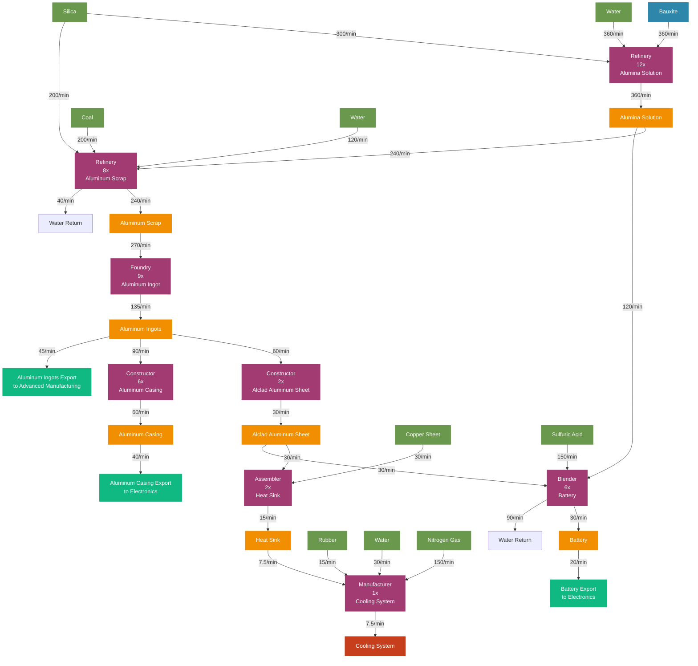

# Aluminum Factory Flow Chart - Jesse Style

## Aluminum Production Flow Diagram (Visual Style)



## Production Chain Overview

### Material Flow Summary
```
Bauxite (360/min) + Silica (500/min) + Water (480/min) + Coal (200/min)
    ↓
Alumina Solution (360/min)
    ├── → Aluminum Scrap (240/min) → Aluminum Ingots (135/min)
    │   ├── → Alclad Aluminum Sheet (30/min)
    │   │   ├── → Heat Sink (15/min) → Cooling System (7.5/min)
    │   │   └── → Battery (30/min) ◄── Electronics Export
    │   └── → Aluminum Casing (60/min)
    │       ├── → Export to Electronics (40/min)
    │       └── → Internal Use (20/min)
    └── → Battery Production (120/min direct)

Primary Outputs:
├── Cooling System (7.5/min) ◄── Late-Game Component
├── Battery (30/min) ◄── Electronics Export
├── Aluminum Casing (40/min) ◄── Electronics Export
├── Heat Sink (15/min) ◄── Advanced Manufacturing
└── Aluminum Ingots (45/min) ◄── Advanced Manufacturing Export
```

### Machine Layout by Floor

#### Floor 1: Alumina Solution Production
| Machine | Count | Input | Output | Power |
|---------|-------|-------|--------|--------|
| Refinery (Alumina Solution) | 12x | 360 Bauxite + 360 Water + 300 Silica/min | 360 Alumina Solution/min | 360 MW |

#### Floor 2: Aluminum Scrap Production
| Machine | Count | Input | Output | Power |
|---------|-------|-------|--------|--------|
| Refinery (Aluminum Scrap) | 8x | 240 Alumina Solution + 200 Coal + 120 Water + 200 Silica/min | 240 Aluminum Scrap + 40 Water/min | 240 MW |

#### Floor 3: Aluminum Ingot Production
| Machine | Count | Input | Output | Power |
|---------|-------|-------|--------|--------|
| Foundry (Aluminum Ingot) | 9x | 270 Aluminum Scrap/min | 135 Aluminum Ingots/min | 180 MW |

#### Floor 4: Basic Aluminum Components
| Machine | Count | Input | Output | Power |
|---------|-------|-------|--------|--------|
| Constructor (Alclad Sheet) | 2x | 60 Aluminum Ingots/min | 30 Alclad Aluminum Sheet/min | 8 MW |
| Constructor (Aluminum Casing) | 6x | 90 Aluminum Ingots/min | 60 Aluminum Casing/min | 24 MW |

#### Floor 5: Advanced Components
| Machine | Count | Input | Output | Power |
|---------|-------|-------|--------|--------|
| Assembler (Heat Sink) | 2x | 30 Alclad Sheet + 30 Copper Sheet/min | 15 Heat Sink/min | 30 MW |

#### Floor 6: Final Products
| Machine | Count | Input | Output | Power |
|---------|-------|-------|--------|--------|
| Manufacturer (Cooling System) | 1x | 7.5 Heat Sink + 15 Rubber + 30 Water + 150 Nitrogen Gas/min | 7.5 Cooling System/min | 55 MW |
| Blender (Battery) | 6x | 120 Alumina Solution + 150 Sulfuric Acid + 30 Alclad Sheet/min | 30 Battery + 90 Water/min | 300 MW |

### External Dependencies

#### Required Inputs (External Sources)
| Material | Rate/min | Source |
|----------|----------|---------|
| Bauxite | 360/min | Miner |
| Silica | 500/min | Quartz Factory |
| Coal | 200/min | Miner |
| Water | 480/min | Water Extractor |
| Copper Sheet | 30/min | Copper Factory |
| Rubber | 15/min | Oil Processing Factory |
| Nitrogen Gas | 150/min | Gas Extractor |
| Sulfuric Acid | 150/min | Oil Processing Factory |

#### Outputs (To Other Factories)
| Material | Rate/min | Destination |
|----------|----------|-------------|
| Aluminum Casing | 40/min | Electronics/Quartz Factory |
| Battery | 30/min | Electronics/Computer Factory |
| Aluminum Ingots | 45/min | Advanced Manufacturing |
| Heat Sink | 15/min surplus | Advanced Electronics |
| Cooling System | 7.5/min | Nuclear/Quantum Factory |

### Power Requirements
- **Total Power Consumption:** 1,197 MW
- **High Power Demand:** One of the most power-intensive factories
- **Water Recycling:** 130/min water return reduces external water needs

### Factory Layout Notes

#### Floor Organization
1. **Floor 1:** Alumina Solution (foundation processing)
2. **Floor 2:** Aluminum Scrap (intermediate processing)
3. **Floor 3:** Aluminum Ingots (metal production)
4. **Floor 4:** Basic components (sheets and casings)
5. **Floor 5:** Advanced components (heat sinks)
6. **Floor 6:** Final products (cooling systems and batteries)

#### Design Philosophy
- **Volume Processing:** High-throughput aluminum metal production
- **Multi-Product Focus:** Serves electronics, advanced manufacturing, and late-game needs
- **Resource Intensive:** Major consumer of bauxite, silica, coal, and water
- **Export Oriented:** Multiple product streams for different factory needs
- **Water Management:** Internal water recycling reduces external demands

#### Integration Notes
- **Silica Dependency:** Requires 500/min silica from Quartz factory
- **Chemical Integration:** Uses sulfuric acid from oil processing
- **Electronics Support:** Provides aluminum casing and batteries
- **Late-Game Ready:** Cooling systems for nuclear and quantum applications

### Resource Node Requirements
Optimal placement near:
- **Pure Bauxite Nodes:** 360/min bauxite consumption
- **Water Access:** 350/min net water consumption (after recycling)
- **Coal Nodes:** 200/min for aluminum scrap production
- **Nitrogen Gas Wells:** 150/min for cooling system production

### Scaling Considerations
- **Electronics Demand:** Aluminum casing production can be increased for heavy electronics use
- **Battery Production:** Can be scaled up for large-scale electronics manufacturing
- **Heat Sink Surplus:** Available for expansion into advanced electronics
- **Modular Design:** Each floor can be scaled independently based on demand

This aluminum factory provides the essential aluminum supply chain while maintaining clear separation from the focused Quartz electronics factory, allowing both facilities to operate optimally in their specialized roles.
