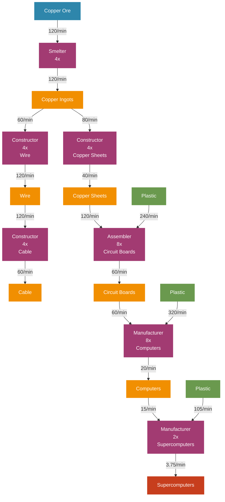

# Copper Factory Flow Chart - Jesse Style

## Copper Production Flow Diagram (Visual Style)



## Production Chain Overview

### Material Flow Summary
```
Copper Ore (120/min)
    ↓ 
Copper Ingots (120/min)
    ├── Copper Sheets (40/min) → Circuit Boards (60/min)
    └── Wire (120/min) → Cable (60/min)
                           ↓
                       Computers (20/min)
                           ↓
                       Supercomputers (3.75/min) ◄── Primary Product

External Dependencies:
└── Plastic (665/min total) ◄── Major Dependency
```

### Machine Layout by Floor

#### Floor 1: Primary Processing
| Machine | Count | Input | Output |
|---------|-------|-------|--------|
| Smelter | 4x | 120 Copper Ore/min | 120 Copper Ingots/min |

#### Floor 2: Component Manufacturing  
| Machine | Count | Input | Output |
|---------|-------|-------|--------|
| Constructor (Sheets) | 4x | 80 Copper Ingots/min | 40 Copper Sheets/min |
| Constructor (Wire) | 4x | 60 Copper Ingots/min | 120 Wire/min |

#### Floor 3: Intermediate Assembly
| Machine | Count | Input | Output |
|---------|-------|-------|--------|
| Constructor (Cable) | 4x | 120 Wire/min | 60 Cable/min |
| Assembler (Circuit Boards) | 8x | 120 Copper Sheets + 240 Plastic/min | 60 Circuit Boards/min |

#### Floor 4: Final Assembly
| Machine | Count | Input | Output |
|---------|-------|-------|--------|
| Manufacturer (Computers) | 8x | 80 Circuit Boards + 320 Plastic/min | 20 Computers/min |

#### Floor 5: Advanced Assembly
| Machine | Count | Input | Output |
|---------|-------|-------|--------|
| Manufacturer (Supercomputers) | 2x | 15 Computers + 105 Plastic/min | 3.75 Supercomputers/min |

### Critical Design Notes

**Distribution Strategy:**
- **Copper Ingots Split 2 Ways:** 67% to copper sheets, 33% to wire
- **Wire is High Volume:** 120/min output requires multiple belts
- **Plastic is Critical:** 560/min total plastic consumption
- **Circuit Boards are Key Hub:** Feed into computers and equipment

**Belt Management:**
- **Floor 2 → Floor 3:** Wire and copper sheets (high volume)
- **Floor 3 → Floor 4:** Circuit boards (lower volume, higher value)
- **Plastic Distribution:** Major external input requirement

**External Dependencies:**
- **Plastic Pipeline:** Must connect to oil processing (560/min total)
- **Iron Integration:** Minor input for equipment production
- **Power Grid:** High power consumption (4,430 MW total)

**Power Requirements:**
- **Total Consumption:** ~4,430 MW
- **Critical Machines:** Manufacturers consume most power (275 MW each)
- **Scaling Factor:** Linear scaling for additional miners

### Plastic Consumption Breakdown
- **Circuit Boards:** 240 Plastic/min
- **Computers:** 320 Plastic/min
- **Supercomputers:** 105 Plastic/min
- **Total Required:** 665 Plastic/min

### Key Ratios
- **1 Copper Ore Miner** supports this entire production chain
- **Plastic Requirement:** 5.54 Plastic per 1 Copper Ore
- **Primary Output:** 3.75 Supercomputers/min (ultra-high-value electronics)
- **Power Efficiency:** Supercomputers are among the highest value items in the game

### Integration Points
- **Oil Processing:** Essential plastic supply connection
- **Main Bus:** Computer, circuit board, and supercomputer distribution
- **Power Grid:** Substantial power infrastructure required
