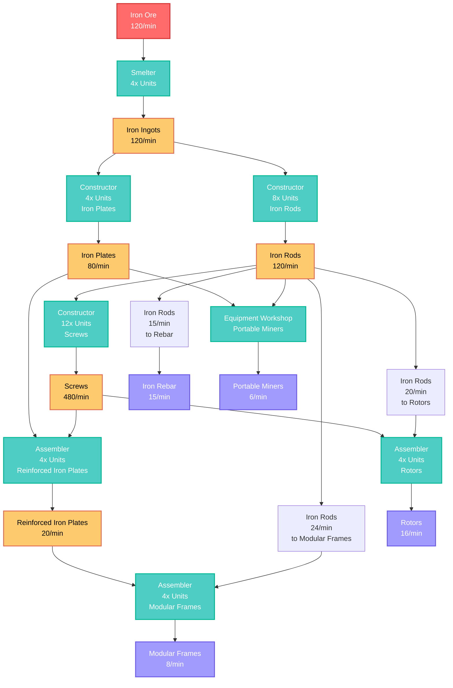

# Iron Factory Flow Chart

## Production Flow Diagram with Input/Output Rates

## Detailed Flow Breakdown

### Production Chain Summary:
- **Input:** 120 Iron Ore/min (1 Normal Iron Node)
- **Primary Output:** 8 Modular Frames/min
- **Secondary Outputs:** 16 Rotors/min, 6 Portable Miners/min, 15 Iron Rebar/min

### Machine Count Requirements:
| Machine Type | Quantity | Product | Input Rate | Output Rate |
|--------------|----------|---------|------------|-------------|
| Smelter | 4 | Iron Ingots | 120 Iron Ore/min | 120 Iron Ingots/min |
| Constructor | 4 | Iron Plates | 120 Iron Ingots/min | 80 Iron Plates/min |
| Constructor | 8 | Iron Rods | 120 Iron Ingots/min | 120 Iron Rods/min |
| Constructor | 12 | Screws | 120 Iron Rods/min | 480 Screws/min |
| Constructor | 1 | Iron Rebar | 15 Iron Rods/min | 15 Iron Rebar/min |
| Assembler | 4 | Reinforced Iron Plates | 120 Iron Plates + 240 Screws/min | 20 Reinforced Iron Plates/min |
| Assembler | 4 | Rotors | 80 Iron Rods + 400 Screws/min | 16 Rotors/min |
| Assembler | 4 | Modular Frames | 12 Reinforced Iron Plates + 48 Iron Rods/min | 8 Modular Frames/min |
| Equipment Workshop | 1 | Portable Miners | 12 Iron Plates + 24 Iron Rods/min | 6 Portable Miners/min |

### Critical Split Points:
1. **Iron Ingots (120/min)** splits to:
   - Iron Plates: 120/min
   - Iron Rods: 120/min

2. **Iron Rods (120/min)** splits to:
   - Screws: 120/min (becomes 480 screws)
   - Rotors: 80/min
   - Modular Frames: 48/min
   - Rebar: 15/min
   - Portable Miners: 24/min

3. **Screws (480/min)** splits to:
   - Reinforced Iron Plates: 240/min
   - Rotors: 400/min

4. **Iron Plates (80/min)** splits to:
   - Reinforced Iron Plates: 120/min
   - Portable Miners: 12/min

### Power Requirements:
- **Total Estimated Power:** ~2,240 MW
- **Recommended Power Source:** 3-4 Coal Generators or 1-2 Fuel Generators
