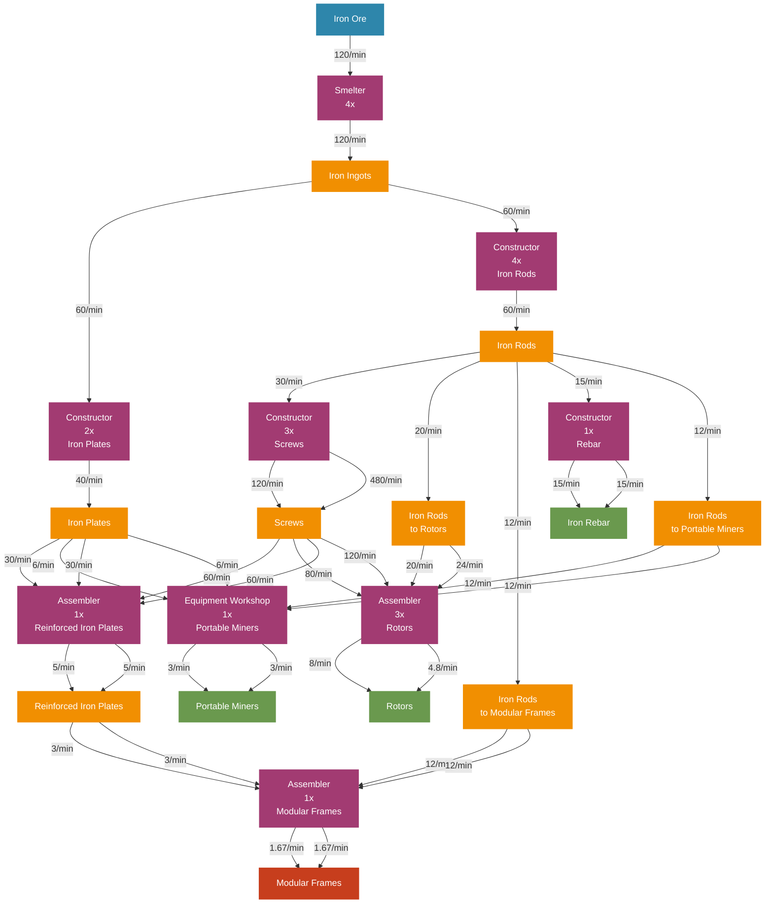

# Iron Factory Flow Chart - Jesse Style

## Iron Production Flow Diagram (Visual Style)



## Production Chain Overview

### Material Flow Summary
```
Iron Ore (120/min)
    ↓ 
Iron Ingots (120/min)
    ├── Iron Plates (40/min) ──┐
    └── Iron Rods (60/min) ────┼── Screws (120/min)
                               │       ├── → Reinforced Iron Plates (5/min)
                               │       └── → Rotors (8/min)
                               ├── → Rotors (20/min direct)
                               ├── → Modular Frames (12/min direct)
                               ├── → Iron Rebar (15/min)
                               └── → Portable Miners (12/min)

Final Outputs:
├── Modular Frames (1.67/min) ◄── Primary Product
├── Rotors (8/min) 
├── Portable Miners (3/min)
└── Iron Rebar (15/min)
```

### Machine Layout by Floor

#### Floor 1: Primary Processing
| Machine | Count | Input | Output |
|---------|-------|-------|--------|
| Smelter | 4x | 120 Iron Ore/min | 120 Iron Ingots/min |

#### Floor 2: Component Manufacturing  
| Machine | Count | Input | Output |
|---------|-------|-------|--------|
| Constructor (Plates) | 2x | 60 Iron Ingots/min | 40 Iron Plates/min |
| Constructor (Rods) | 4x | 60 Iron Ingots/min | 60 Iron Rods/min |
| Constructor (Screws) | 3x | 30 Iron Rods/min | 120 Screws/min |
| Constructor (Rebar) | 1x | 15 Iron Rods/min | 15 Iron Rebar/min |

#### Floor 3: Intermediate Assembly
| Machine | Count | Input | Output |
|---------|-------|-------|--------|
| Assembler (Reinforced Plates) | 1x | 30 Iron Plates + 60 Screws/min | 5 Reinforced Iron Plates/min |
| Assembler (Rotors) | 2x | 20 Iron Rods + 80 Screws/min | 8 Rotors/min |

#### Floor 4: Final Assembly
| Machine | Count | Input | Output |
|---------|-------|-------|--------|
| Assembler (Modular Frames) | 1x | 3 Reinforced Iron Plates + 12 Iron Rods/min | 1.67 Modular Frames/min |
| Equipment Workshop | 1x | 6 Iron Plates + 12 Iron Rods/min | 3 Portable Miners/min |

### Critical Design Notes

**Distribution Strategy:**
- **Iron Rods are the Hub:** Split 5 ways from Floor 2
- **Screw Production:** Largest consumer of iron rods (12 constructors needed)
- **Modular Frames:** Primary high-value output target
- **Balanced Production:** All outputs scale proportionally

**Belt Management:**
- **Floor 2 → Floor 3:** Major throughput requirement (screws + plates)
- **Floor 3 → Floor 4:** Lower volume, higher value materials
- **Horizontal Distribution:** Most complexity on Floor 2

**Power Requirements:**
- **Total Consumption:** ~2,240 MW
- **Critical Machines:** Assemblers consume most power (150 MW each)
- **Scaling Factor:** Linear scaling for additional miners
