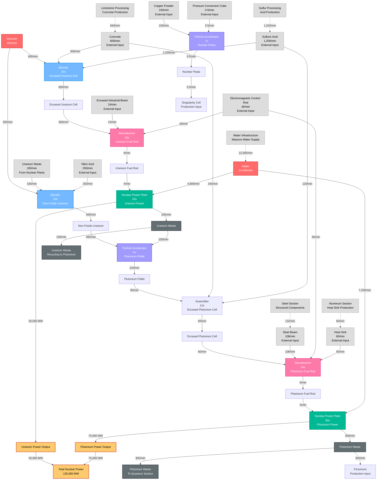

# Nuclear Factory Flow Chart - Jesse Style

## Nuclear Processing Production Flow Diagram (Visual Style)



---

## Production Chain Overview

### Material Flow Summary
```
Uranium (600/min) → [Split 2 ways]
    ├── Encased Uranium Cell (800/min) → Uranium Fuel Rod → 50,000 MW Power
    └── Non-Fissile Uranium (400/min) → Plutonium Processing → 75,000 MW Power
    
Power Generation:
├── Uranium Power: 50,000 MW (20 Nuclear Plants)
├── Plutonium Power: 75,000 MW (30 Nuclear Plants)
└── Total Nuclear Power: 125,000 MW ◄── Massive Energy Output

Waste Processing:
├── Uranium Waste (200/min) → Recycled to Plutonium Processing
├── Plutonium Waste (300/min) → To Quantum Section (Ficsonium)
└── Nuclear Pasta (0.5/min) → Advanced Applications (Singularity Cells)

External Dependencies:
├── Concrete (840/min) ◄── From Limestone Processing
├── Sulfuric Acid (1,320/min) ◄── From Sulfur Processing
├── Water (12,000/min) ◄── Industrial Water Infrastructure
├── Steel Components (132/min) ◄── From Steel Section
└── Heat Sinks (60/min) ◄── From Aluminum Section
```

### Machine Layout by Floor

#### Floor 1: Uranium Processing
| Machine | Count | Input | Output |
|---------|-------|-------|--------|
| Blender (Encased Uranium Cell) | 20x | 400 Uranium + 600 Concrete + 1,200 Sulfuric Acid/min | 800 Encased Uranium Cell/min |
| Blender (Non-Fissile Uranium) | 10x | 200 Uranium + 100 Uranium Waste + 250 Nitric Acid/min | 400 Non-Fissile Uranium/min |

#### Floor 2: Uranium Power Generation
| Machine | Count | Input | Output |
|---------|-------|-------|--------|
| Manufacturer (Uranium Fuel Rod) | 20x | 400 Encased Uranium Cell + 24 Encased Industrial Beam + 40 Electromagnetic Control Rod/min | 8 Uranium Fuel Rod/min |
| Nuclear Power Plant (Uranium) | 20x | 4 Uranium Fuel Rod + 4,800 Water/min | 50,000 MW + 200 Uranium Waste/min |

#### Floor 3: Plutonium Processing
| Machine | Count | Input | Output |
|---------|-------|-------|--------|
| Particle Accelerator (Plutonium Pellet) | 4x | 400 Non-Fissile Uranium + 100 Uranium Waste/min | 120 Plutonium Pellet/min |
| Assembler (Encased Plutonium Cell) | 12x | 60 Plutonium Pellet + 240 Concrete + 120 Sulfuric Acid/min | 60 Encased Plutonium Cell/min |

#### Floor 4: Plutonium Power Generation
| Machine | Count | Input | Output |
|---------|-------|-------|--------|
| Manufacturer (Plutonium Fuel Rod) | 24x | 60 Encased Plutonium Cell + 108 Steel Beam + 36 Electromagnetic Control Rod + 60 Heat Sink/min | 6 Plutonium Fuel Rod/min |
| Nuclear Power Plant (Plutonium) | 30x | 3 Plutonium Fuel Rod + 7,200 Water/min | 75,000 MW + 300 Plutonium Waste/min |

#### Floor 5: Advanced Nuclear Materials
| Machine | Count | Input | Output |
|---------|-------|-------|--------|
| Particle Accelerator (Nuclear Pasta) | 1x | 100 Copper Powder + 0.5 Pressure Conversion Cube/min | 0.5 Nuclear Pasta/min |

### Power Analysis

#### Power Consumption vs Generation
| Component | Count | Power Consumption | Power Generation | Net Power |
|-----------|--------|------------------|------------------|-----------|
| Blenders | 30x | 2,250 MW | 0 MW | -2,250 MW |
| Manufacturers | 44x | 12,100 MW | 0 MW | -12,100 MW |
| Assemblers | 12x | 1,800 MW | 0 MW | -1,800 MW |
| Particle Accelerators | 5x | 1,250-3,750 MW | 0 MW | -1,250 to -3,750 MW |
| Water Extractors | 40x | 800 MW | 0 MW | -800 MW |
| Nuclear Power Plants | 50x | 0 MW | 125,000 MW | +125,000 MW |
| **Total** | **181x** | **18,200-20,700 MW** | **125,000 MW** | **+104,300-106,800 MW** |

### Critical Design Notes

**Nuclear Power Efficiency:**
- **Input:** 600 Uranium/min → 125,000 MW output
- **ROI:** 5-6x more power generated than consumed
- **Water Critical:** 12,000 water/min requirement for full operation
- **Waste Management:** Uranium waste recycled, plutonium waste exported

**Material Dependencies:**
- **Concrete Production:** 840/min from limestone processing
- **Acid Production:** 1,320/min sulfuric acid from sulfur processing
- **Steel Integration:** 132/min steel components from steel section
- **Water Infrastructure:** Industrial-scale water extraction and distribution

**Production Scaling:**
- **Uranium Processing:** Blenders handle massive material throughput
- **Nuclear Arrays:** 50 nuclear power plants for full power generation
- **Waste Processing:** Efficient uranium waste recycling to plutonium
- **Advanced Materials:** Nuclear pasta for ultimate technology applications

**Safety and Infrastructure:**
- **Radioactive Materials:** Careful handling and storage required
- **Power Distribution:** Massive power grid infrastructure needed
- **Water Management:** Enormous water consumption and distribution
- **Waste Storage:** Long-term radioactive waste containment systems

**Strategic Value:**
- **Primary Power Source:** Foundation for entire factory power grid
- **Plutonium Waste Export:** Essential input for quantum section Ficsonium
- **Nuclear Pasta Production:** Advanced material for singularity technology
- **Energy Independence:** Self-sufficient power generation with massive surplus
```
