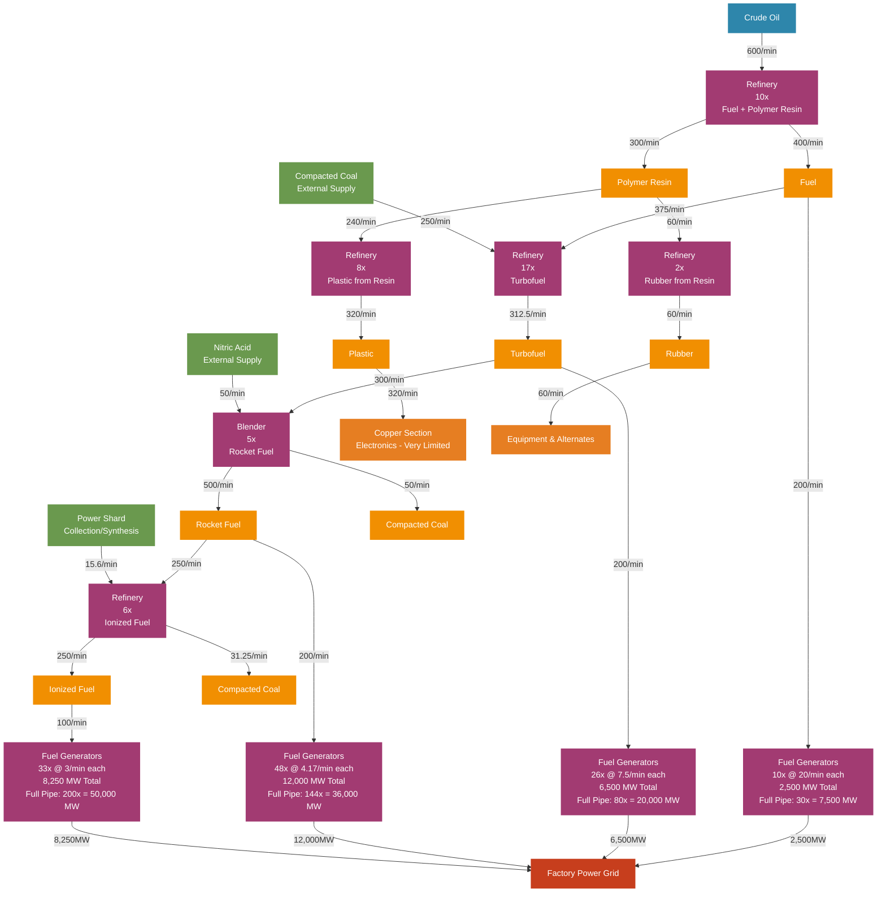

# Oil Processing Factory Flow Chart - Jesse Style

## Oil Processing Production Flow Diagram (Visual Style)



## Production Chain Overview

### Material Flow Summary
```
Crude Oil (600/min) → Fuel + Polymer Resin Production [PIPELINE LIMITED]
    ├── Fuel (400/min) → Advanced Fuel Processing
    └── Polymer Resin (300/min) → [Split 2 ways]
        ├── Plastic (320/min) → Electronics Manufacturing (VERY LIMITED - only 48% of needs)
        └── Rubber (60/min) → Equipment & Alternates
    
Fuel (400/min) → Advanced Fuel Processing
                    ↓
                Turbofuel (312.5/min)
                    ↓
                Rocket Fuel (500/min)
                    ↓
                Ionized Fuel (250/min) ◄── Ultimate Energy Source

Power Generation Capability:
├── Fuel: 2,500 MW (10 generators @ 20/min each) → Full Pipe: 7,500 MW (30 generators)
├── Turbofuel: 6,500 MW (26 generators @ 7.5/min each) → Full Pipe: 20,000 MW (80 generators)
├── Rocket Fuel: 12,000 MW (48 generators @ 4.17/min each) → Full Pipe: 36,000 MW (144 generators)
└── Ionized Fuel: 8,250 MW (33 generators @ 3/min each) → Full Pipe: 50,000 MW (200 generators)
Total: 29,250 MW ◄── Current Pipeline Limited | Full Pipe Potential: 113,500 MW

External Dependencies:
├── Compacted Coal (300/min) ◄── From Coal + Sulfur Processing  
├── Nitric Acid (50/min) ◄── From Nitrogen Gas + Water
└── Power Shards (15.6/min) ◄── From Collection or Synthetic Production

CRITICAL LIMITATION: Single 600/min pipeline severely restricts throughput
NOTE: Plastic output (320/min) is insufficient for copper section needs (665/min required)
```

### Machine Layout by Floor

#### Floor 1: Primary Processing (Pipeline Limited)
| Machine | Count | Input | Output |
|---------|-------|-------|--------|
| Refinery (Fuel) | 10x | 600 Crude Oil/min | 400 Fuel/min + 300 Polymer Resin/min |

#### Floor 2: Resin Processing (Very Limited Output)
| Machine | Count | Input | Output |
|---------|-------|-------|--------|
| Refinery (Plastic from Resin) | 8x | 240 Polymer Resin/min | 320 Plastic/min |
| Refinery (Rubber from Resin) | 2x | 60 Polymer Resin/min | 60 Rubber/min |

#### Floor 3: Advanced Fuel Processing (Reduced Scale)
| Machine | Count | Input | Output |
|---------|-------|-------|--------|
| Refinery (Turbofuel) | 17x | 375 Fuel + 250 Compacted Coal/min | 312.5 Turbofuel/min |
| Blender (Rocket Fuel) | 5x | 300 Turbofuel + 50 Nitric Acid/min | 500 Rocket Fuel + 50 Compacted Coal/min |
| Refinery (Ionized Fuel) | 6x | 250 Rocket Fuel + 15.6 Power Shards/min | 250 Ionized Fuel + 31.25 Compacted Coal/min |

#### Floor 4: Distribution Hub (Severely Limited)
| Output Stream | Rate | Destination |
|---------------|------|-------------|
| Plastic to Electronics | 320/min | Copper Section (CRITICALLY INSUFFICIENT - only 48% of 665/min needs) |
| Rubber to Equipment | 60/min | Equipment, alternate recipes (minimal) |

#### Floor 5: Power Generation (High Output)
| Fuel Type | Available Rate | Burn Rate | Generator Count | Power Output | Full Pipe (600/min) | Full Pipe Power |
|-----------|----------------|-----------|-----------------|--------------|---------------------|-----------------|
| Fuel | 200/min | 20/min each | 10x | 2,500 MW | 30x | 7,500 MW |
| Turbofuel | 200/min | 7.5/min each | 26x | 6,500 MW | 80x | 20,000 MW |
| Rocket Fuel | 200/min | 4.17/min each | 48x | 12,000 MW | 144x | 36,000 MW |
| Ionized Fuel | 100/min | 3/min each | 33x | 8,250 MW | 200x | 50,000 MW |
| **Total Power Generation** | | | **117x Generators** | **29,250 MW** | **454x Generators** | **113,500 MW** |

### Critical Design Notes

**Distribution Strategy:**
- **Plastic Priority:** 320/min to copper section for electronics (48% of 665/min needs)
- **Fuel Progression:** Sequential refinement for maximum energy efficiency
- **Power Generation Focus:** Oil processing becomes factory's primary power source
- **Chemical Integration:** Requires coordination with coal, nitrogen, and power shard sources

**Power Scaling Potential:**
- **Current Setup:** 29,250 MW from production-limited fuel rates
- **Full Pipeline Scaling:** Up to 113,500 MW if dedicated 600/min pipelines fed each generator type
- **Ionized Fuel Supremacy:** 200 generators possible with full pipe (50,000 MW from single fuel type)
- **Pipeline Strategy:** Multiple dedicated fuel pipelines unlock massive power scaling

**Fluid Management:**
- **Pipeline Limited Network:** 600 crude oil/min input (single pipeline)
- **Resin Storage Critical:** Large buffer tanks for polymer resin distribution
- **Direct Fuel Production:** No dependency on heavy oil residue or alternate recipes

**External Dependencies:**
- **Coal Processing Integration:** Essential for compacted coal supply (250/min total)
- **Nitrogen Processing:** Required for nitric acid production (50/min)
- **Power Shard Supply:** Collection routes or synthetic production setup (15.6/min)
- **Water Infrastructure:** Supporting nitric acid and other processes

**Power Requirements vs Output:**
- **Consumption:** ~2,000 MW for oil processing operations
- **Generation:** 29,250 MW total power output
- **Net Contribution:** +27,250 MW to factory power grid

### Fuel Efficiency Analysis
| Fuel Type | Energy (MJ) | Efficiency vs Base | Generator Output | Fuel Rate for 1 Generator |
|-----------|-------------|-------------------|------------------|--------------------------|
| Fuel | 750 | 1x | 250 MW | 20/min |
| Turbofuel | 2,000 | 2.67x | 250 MW | 7.5/min |
| Rocket Fuel | 3,600 | 4.8x | 250 MW | 4.17/min |
| Ionized Fuel | 5,000 | 6.67x | 250 MW | 3/min |

### Critical Success Factors
- **Oil Field Development:** Single 600/min crude oil pipeline (pipeline limited design)
- **Direct Fuel Production:** Standard recipes only, no alternate dependencies
- **Chemical Supply Chain:** Reliable compacted coal and nitric acid production
- **Resin Storage Management:** Large polymer resin buffers for flexible plastic/rubber production
- **Power Shard Management:** Sustainable collection or production for ionized fuel (15.6/min)
- **Pipeline Infrastructure:** Extensive fluid handling and storage systems

### Factory Integration Impact
- **Electronics Manufacturing:** Enables copper section with 320/min plastic supply (48% of needs)
- **Limited Material Output:** 320/min plastic and 60/min rubber from pipeline-limited resin
- **Power Independence:** Factory becomes energy self-sufficient with massive surplus
- **Chemical Foundation:** Reduced but efficient plastic/rubber production
- **Simplified Dependencies:** No heavy oil residue or alternate recipe requirements

### Strategic Value
- **Power Generation ROI:** 29,250 MW output from 2,000 MW input (14.6:1 efficiency)
- **Electronics Enabler:** Essential plastic supply for high-value electronics
- **Factory Foundation:** Chemical and energy backbone for entire operation
- **Late Game Scaling:** Ionized fuel enables massive power generation expansion
