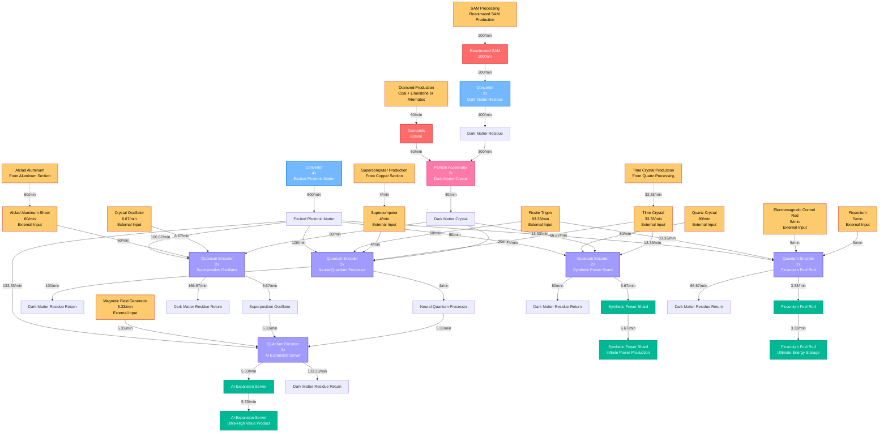

# Quantum Factory Flow Chart - Jesse Style

## Quantum Processing Production Flow Diagram (Visual Style)



---

## Production Chain Overview

### Material Flow Summary
```
Reanimated SAM (200/min) → Dark Matter Residue (400/min)
    ├── Dark Matter Crystal (40/min) → Quantum Components
    └── Excited Photonic Matter (800/min) → Universal Quantum Input
    
Quantum Components:
├── Neural-Quantum Processor (4/min)
├── Superposition Oscillator (6.67/min)
├── AI Expansion Server (5.33/min) ◄── Primary Product
├── Synthetic Power Shard (6.67/min) ◄── Infinite Power Source
└── Ficsonium Fuel Rod (3.33/min) ◄── Ultimate Energy Storage

External Dependencies:
├── Diamonds (60/min) ◄── From Coal/Limestone Processing
├── Supercomputers (4/min) ◄── From Copper Section
├── Time Crystals (33.33/min) ◄── From Quartz Processing
├── Alclad Aluminum Sheets (60/min) ◄── From Aluminum Section
├── Crystal Oscillators (6.67/min) ◄── From Quartz Processing
├── Magnetic Field Generators (5.33/min) ◄── From Caterium Processing
└── Various Advanced Materials ◄── From Multiple Sections
```

### Machine Layout by Floor

#### Floor 1: Basic Quantum Materials
| Machine | Count | Input | Output |
|---------|-------|-------|--------|
| Converter (Dark Matter Residue) | 2x | 200 Reanimated SAM/min | 400 Dark Matter Residue/min |
| Converter (Excited Photonic Matter) | 4x | No input required | 800 Excited Photonic Matter/min |
| Particle Accelerator (Dark Matter Crystal) | 2x | 60 Diamonds + 300 Dark Matter Residue/min | 40 Dark Matter Crystal/min |

#### Floor 2: Quantum Component Manufacturing
| Machine | Count | Input | Output |
|---------|-------|-------|--------|
| Quantum Encoder (Neural-Quantum Processor) | 2x | 20 Time Crystal + 4 Supercomputer + 60 Ficsite Trigon + 100 Excited Photonic Matter/min | 4 Neural-Quantum Processor + 100 Dark Matter Residue/min |
| Quantum Encoder (Superposition Oscillator) | 2x | 20 Dark Matter Crystal + 6.67 Crystal Oscillator + 60 Alclad Aluminum Sheet + 166.67 Excited Photonic Matter/min | 6.67 Superposition Oscillator + 166.67 Dark Matter Residue/min |

#### Floor 3: Advanced Quantum Systems
| Machine | Count | Input | Output |
|---------|-------|-------|--------|
| Quantum Encoder (AI Expansion Server) | 2x | 5.33 Magnetic Field Generator + 5.33 Neural-Quantum Processor + 5.33 Superposition Oscillator + 133.33 Excited Photonic Matter/min | 5.33 AI Expansion Server + 133.33 Dark Matter Residue/min |
| Quantum Encoder (Synthetic Power Shard) | 2x | 13.33 Time Crystal + 13.33 Dark Matter Crystal + 80 Quartz Crystal + 80 Excited Photonic Matter/min | 6.67 Synthetic Power Shard + 80 Dark Matter Residue/min |

#### Floor 4: Ultimate Quantum Technology
| Machine | Count | Input | Output |
|---------|-------|-------|--------|
| Quantum Encoder (Ficsonium Fuel Rod) | 2x | 5 Ficsonium + 5 Electromagnetic Control Rod + 33.33 Ficsite Trigon + 66.67 Excited Photonic Matter/min | 3.33 Ficsonium Fuel Rod + 66.67 Dark Matter Residue/min |

### Power Requirements Analysis
| Machine Type | Count | Power Range | Total Power |
|--------------|--------|-------------|-------------|
| Converter | 6x | 100-400 MW each | 600-2,400 MW |
| Particle Accelerator | 2x | 500-1,500 MW each | 1,000-3,000 MW |
| Quantum Encoder | 8x | 0-2,000 MW each | 0-16,000 MW |
| **Total Power Consumption** | **16x** | | **1,600-21,400 MW** |

### Critical Design Notes

**Quantum Material Flow:**
- **Dark Matter Residue is Central:** All quantum processing stems from this base material
- **Excited Photonic Matter is Universal:** Required in nearly every quantum recipe
- **Dark Matter Residue Recycling:** Quantum Encoders return Dark Matter Residue as byproduct
- **Massive Power Requirements:** Variable power consumption based on production rates

**External Dependencies:**
- **Diamond Production:** Essential for Dark Matter Crystal (60/min required)
- **Electronics Integration:** Supercomputers from copper section (4/min)
- **Material Processing:** Advanced materials from aluminum, quartz, and caterium sections
- **SAM Processing Foundation:** Reanimated SAM production from SAM ore processing

**Power Infrastructure:**
- **Variable Power Consumption:** Quantum Encoders scale power usage with production
- **Peak Power:** Up to 21,400 MW for full quantum processing
- **Nuclear Power Integration:** Requires multiple nuclear power plants or advanced fuel systems

**Strategic Value:**
- **AI Expansion Server:** Enables ultimate automation and space elevator progression
- **Synthetic Power Shard:** Infinite power shard production for ionized fuel
- **Ficsonium Fuel Rod:** Ultimate energy storage technology
- **Technology Gateway:** Quantum section unlocks end-game content progression
```
