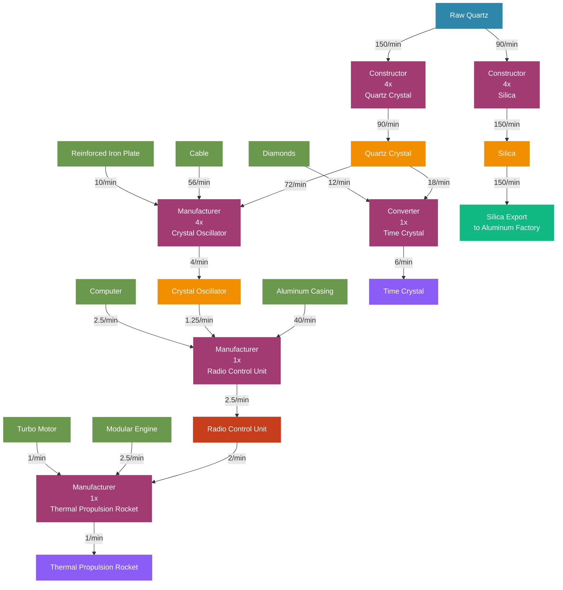

# Quartz Factory Flow Chart - Jesse Style

## Quartz Processing Production Flow Diagram (Visual Style)



## Production Chain Overview

### Material Flow Summary
```
Raw Quartz (240/min total)
    ├── Quartz Crystal (90/min) 
    │   ├── → Crystal Oscillator (4/min)
    │   │   └── → Radio Control Unit (2.5/min)
    │   │       └── → Thermal Propulsion Rocket (1/min) ◄── Space Elevator
    │   └── → Time Crystal (6/min) ◄── Quantum Processing
    └── Silica (150/min) → Export to Aluminum Factory

Primary Outputs:
├── Crystal Oscillator (4/min) ◄── High-Tech Component
├── Radio Control Unit (2.5/min) ◄── Space Elevator Tier
├── Thermal Propulsion Rocket (1/min) ◄── Space Elevator Final
├── Time Crystal (6/min) ◄── Quantum Processing
└── Silica Export (150/min) ◄── Aluminum Factory Input
```

### Machine Layout by Floor

#### Floor 1: Primary Quartz Processing
| Machine | Count | Input | Output | Power |
|---------|-------|-------|--------|--------|
| Constructor (Quartz Crystal) | 4x | 150 Raw Quartz/min | 90 Quartz Crystal/min | 16 MW |
| Constructor (Silica) | 4x | 90 Raw Quartz/min | 150 Silica/min | 16 MW |

#### Floor 2: Crystal Oscillator Manufacturing
| Machine | Count | Input | Output | Power |
|---------|-------|-------|--------|--------|
| Manufacturer (Crystal Oscillator) | 4x | 72 Quartz Crystal + 56 Cable + 10 Reinforced Iron Plate/min | 4 Crystal Oscillator/min | 220 MW |

#### Floor 3: Radio Control Unit Assembly
| Machine | Count | Input | Output | Power |
|---------|-------|-------|--------|--------|
| Manufacturer (Radio Control Unit) | 1x | 40 Aluminum Casing + 1.25 Crystal Oscillator + 2.5 Computer/min | 2.5 Radio Control Unit/min | 55 MW |

#### Floor 4: Space Elevator Components
| Machine | Count | Input | Output | Power |
|---------|-------|-------|--------|--------|
| Manufacturer (Thermal Propulsion Rocket) | 1x | 2.5 Modular Engine + 1 Turbo Motor + 2 Radio Control Unit/min | 1 Thermal Propulsion Rocket/min | 55 MW |

#### Floor 5: Quantum Era Processing
| Machine | Count | Input | Output | Power |
|---------|-------|-------|--------|--------|
| Converter (Time Crystal) | 1x | 12 Diamonds + 18 Quartz Crystal/min | 6 Time Crystal/min | 100-400 MW |

### External Dependencies

#### Required Inputs (External Factories)
| Material | Rate/min | Source Factory |
|----------|----------|----------------|
| Cable | 56/min | Copper Factory |
| Reinforced Iron Plate | 10/min | Iron Factory |
| Aluminum Casing | 40/min | Aluminum Factory |
| Computer | 2.5/min | Copper Factory |
| Modular Engine | 2.5/min | Motor Factory |
| Turbo Motor | 1/min | Motor Factory |
| Diamonds | 12/min | Coal Processing/Miner |

#### Outputs (To Other Factories)
| Material | Rate/min | Destination |
|----------|----------|-------------|
| Crystal Oscillator | 2.75/min available | Computer/Supercomputer Factory |
| Time Crystal | 6/min | Quantum Factory |
| Silica | 150/min | Aluminum Factory |

### Power Requirements
- **Total Power Consumption:** ~362-662 MW (depending on Converter power draw)
- **Peak Efficiency Power:** 362 MW
- **Quantum Processing Power:** +300 MW variable

### Factory Layout Notes

#### Floor Organization
1. **Ground Floor:** Raw Quartz input and basic processing
2. **Floor 2:** Crystal Oscillator production (high-value, low-volume)
3. **Floor 3:** Radio Control Units (space elevator preparation)
4. **Floor 4:** Thermal Propulsion Rockets (final space elevator tier)
5. **Floor 5:** Quantum era processing (Time Crystal production)

#### Design Philosophy
- **Electronics Focus:** Specialized in high-tech precision components
- **Space Elevator Ready:** Direct path to final space elevator components
- **Quantum Prepared:** Time Crystal production for late-game quantum processing
- **Clean Separation:** Silica export maintains aluminum factory independence
- **Scalable Output:** Crystal Oscillators can be distributed to multiple consumers

#### Optimization Notes
- Quartz Crystal production slightly over-produces to ensure Crystal Oscillator efficiency
- Time Crystal converter placed for easy quantum factory integration
- Radio Control Unit production sized for space elevator requirements
- Silica production provides clean export to dedicated aluminum factory
- Compact 5-floor design focuses on electronics specialization

### Space Elevator Integration
This factory specifically targets the **Phase 4** space elevator requirements:
- **Thermal Propulsion Rocket:** 1/min production rate
- **Radio Control Unit:** Key intermediate component
- **Crystal Oscillator:** Critical high-tech component

The design ensures steady progression through space elevator tiers while maintaining flexibility for other high-tech applications.
