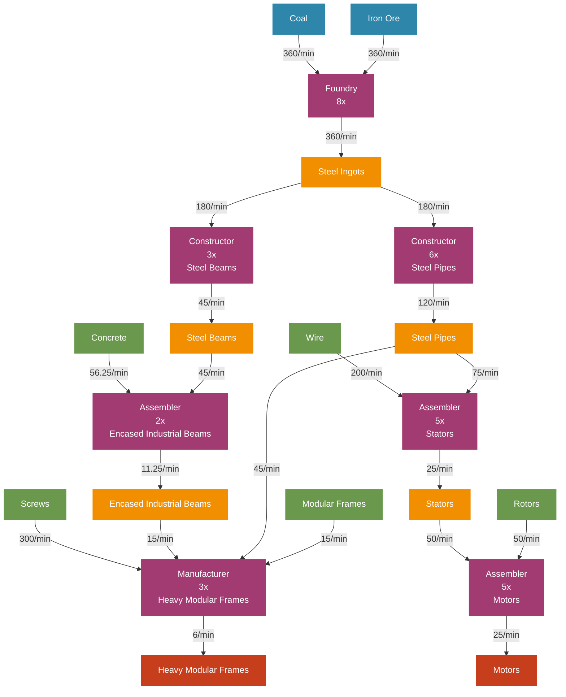

# Steel & Motors Factory Flow Chart - Jesse Style

## Steel & Motors Production Flow Diagram (Visual Style)



## Production Chain Overview

### Material Flow Summary
```
Iron Ore (360/min) + Coal (360/min)
    ↓ 
Steel Ingots (360/min)
    ├── Steel Beams (45/min) → Encased Industrial Beams (11.25/min)
    └── Steel Pipes (120/min) → Stators (25/min) + Heavy Modular Frames (6/min)
                                    ↓
                                Motors (25/min) ◄── Primary Product
                                    ↓
                            Heavy Modular Frames (6/min) ◄── Ultra-High Value Product

External Dependencies:
├── Concrete (56.25/min) ◄── From Limestone Processing
├── Wire (200/min) ◄── From Copper Section
├── Rotors (50/min) ◄── From Iron Section
├── Modular Frames (15/min) ◄── From Iron Section
└── Screws (300/min) ◄── From Iron Section
```

### Machine Layout by Floor

#### Floor 1: Primary Processing
| Machine | Count | Input | Output |
|---------|-------|-------|--------|
| Foundry | 8x | 360 Iron Ore + 360 Coal/min | 360 Steel Ingots/min |

#### Floor 2: Component Manufacturing  
| Machine | Count | Input | Output |
|---------|-------|-------|--------|
| Constructor (Steel Beams) | 3x | 180 Steel Ingots/min | 45 Steel Beams/min |
| Constructor (Steel Pipes) | 6x | 180 Steel Ingots/min | 120 Steel Pipes/min |

#### Floor 3: Intermediate Assembly
| Machine | Count | Input | Output |
|---------|-------|-------|--------|
| Assembler (Encased Industrial Beams) | 2x | 45 Steel Beams + 56.25 Concrete/min | 11.25 Encased Industrial Beams/min |
| Assembler (Stators) | 5x | 75 Steel Pipes + 200 Wire/min | 25 Stators/min |

#### Floor 4: Advanced Assembly
| Machine | Count | Input | Output |
|---------|-------|-------|--------|
| Assembler (Motors) | 5x | 50 Rotors + 50 Stators/min | 25 Motors/min |
| Manufacturer (Heavy Modular Frames) | 3x | 15 Modular Frames + 45 Steel Pipes + 15 Encased Industrial Beams + 300 Screws/min | 6 Heavy Modular Frames/min |

### Critical Design Notes

**Distribution Strategy:**
- **Steel Ingots Split Evenly:** 50% to steel beams, 50% to steel pipes
- **Steel Pipes High Demand:** Used in both stators and heavy modular frames
- **External Input Heavy:** Requires coordination with 3+ other factory sections
- **Heavy Modular Frames are Ultimate Goal:** Highest value output

**Belt Management:**
- **Floor 2 → Floor 3:** Steel beams and pipes (high volume)
- **Floor 3 → Floor 4:** Lower volume, higher value materials
- **External Input Distribution:** Major coordination requirement

**External Dependencies:**
- **Iron Section Integration:** Critical for rotors, modular frames, and screws
- **Copper Section Integration:** Essential for wire supply
- **Limestone Processing:** Required for concrete input
- **Coal Mining:** Direct coal requirement for steel production

**Power Requirements:**
- **Total Consumption:** ~4,465 MW
- **Critical Machines:** Manufacturers consume most power (275 MW each)
- **Scaling Factor:** Linear scaling based on foundry count

### External Input Breakdown
- **From Iron Section:** Rotors (50/min), Modular Frames (15/min), Screws (300/min)
- **From Copper Section:** Wire (200/min)
- **From Limestone Processing:** Concrete (56.25/min)
- **Direct Mining:** Iron Ore (360/min), Coal (360/min)

### Key Ratios
- **8 Foundries** support this entire production chain
- **Steel Consumption Efficiency:** 72 Steel Ingots per Motor produced
- **Primary Outputs:** 25 Motors/min + 6 Heavy Modular Frames/min
- **Integration Complexity:** Requires inputs from 4+ different production areas

### Critical Success Factors
- **Multi-Section Coordination:** Most complex integration in the factory
- **Input Stream Reliability:** Any shortage breaks the entire chain
- **Heavy Modular Frame Focus:** Ultra-high value justifies complexity
- **Strategic Positioning:** Central location for easy access to all input sources

### Production Value Analysis
- **Motors:** 1,520 sink points each (38,000 points/min total)
- **Heavy Modular Frames:** 11,520 sink points each (69,120 points/min total)
- **Total Value Output:** 107,120 sink points/min
- **Value per Steel Ingot:** 595 sink points (extremely efficient)

### Integration Points
- **Iron Section:** Primary supplier of mechanical components
- **Copper Section:** Essential wire supplier for electrical components
- **Limestone Processing:** Concrete supplier for structural components
- **Coal Mining:** Direct fuel input for steel production
- **Main Bus:** Distribution of motors and heavy modular frames to advanced recipes
- **Power Grid:** Substantial power infrastructure required
